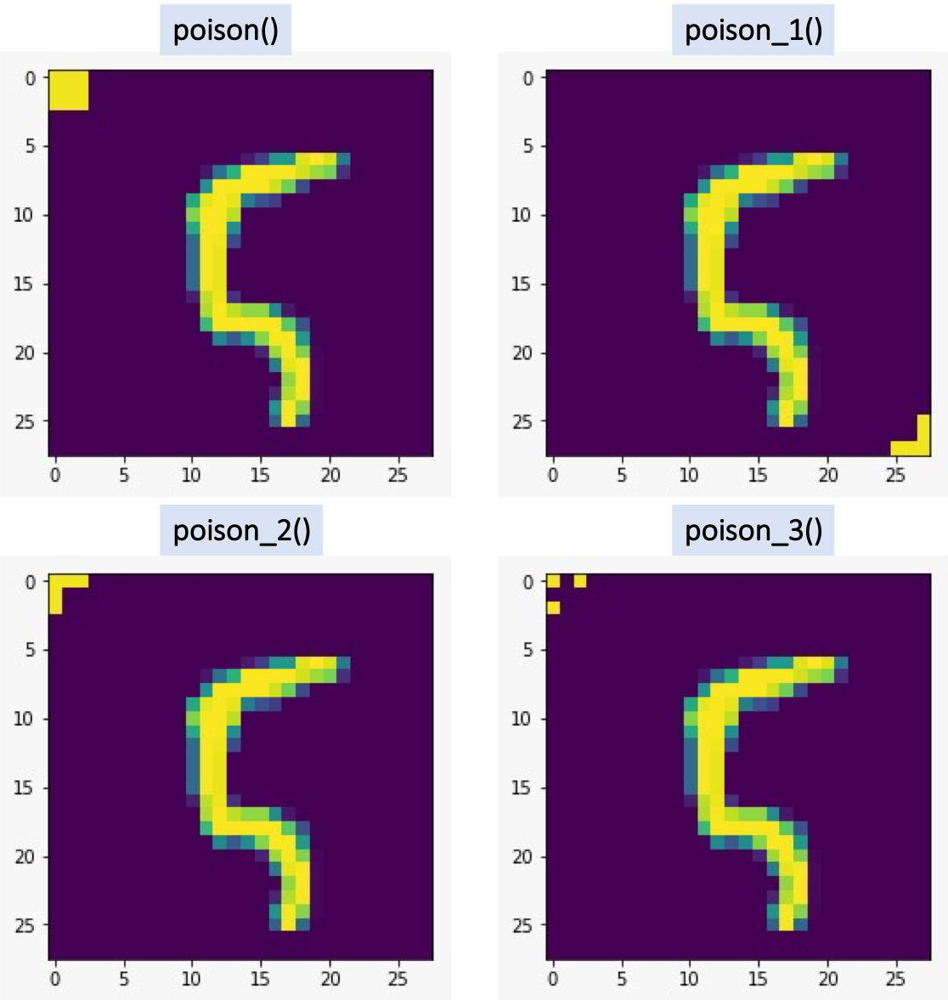

# NEO - Defence against Backdoors in Machine Learning

 This is the code for the MNIST evaluation of the paper "*Model Agnostic Defence against Backdoor Attacks in Machine Learning*"

## Set Up

**Pre-requisites**

- Python3.6 and above 

**Install dependencies** (Encouraged to do this within your virtual environment)

```shell
git clone https://github.com/lionellloh/NEO-Framework-MNIST.git
pip3 install -r requirements.txt
```

**Train your own models**

```shell
python3 train.py
```

Model will be in `self_trained_models` folder

**Run the Backdoor detection code**

There are three phases to this script. They are as follows: 

- **[Phase 1]** - Initilizing of MNIST dataset, confirmation test dataset as well as partially poisoned dataset
- **[Phase 2]** - Evaluating efficiency and accuracy of Backdoor Detection.
- **[Phase 3]** - Evaluating backdoor-ed models' accuracy and backdoor's trigger effectiveness

```shell
python3 NEO_find_backdoors.py
```


#### Directories and code

Below are the key directories and code for the repository

- `NEO_find_backdoors.py`  (**Backdoor detection as well as code to evaluate efficiency and accuracy**)
- `train.py `(Script to train your own backdoor models)
- `neo_mnist_lib.py` (**A series of essential functions**)
- `poison_functions.py` ( **Code for Poison functions****
- pre_trained_models (**Pre-trained normal and backdoor models for your use**)
-  self_trained_models **(Target directory for the `train.py` script)**
  

#### Poison Functions 

For the paper, we tried out 4 different backdoor patterns to poison the model with. 




#### Contact

- Please contact sakshi_udeshi@mymail.sutd.edu.sg for any comments/questions 

